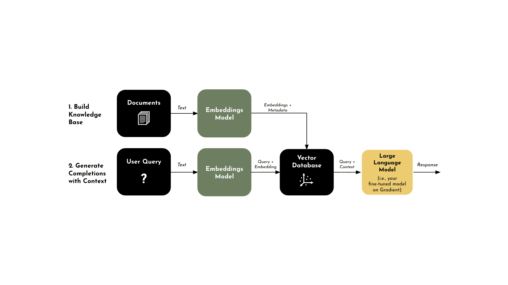

# RAG 101 for Enterprise

Increasingly more business are leveraging AI to augment their organizations and large language models (LLMs) are behind what's powering these incredible opportunities. However the process of optimizing LLMs with methods like retrieval augmented generation (RAG) can be complex, which is why we'll be walking you through everything you should consider before you get started.

## Optimizing LLMs

Before we dive into the topic of retrieval augmented generation (RAG), lets take a step back and talk about what it means to optimize large language models (LLMs). For those who are unfamiliar with LLMs, they're essentially deep learning algorithms capable of preforming a wide range of natural language processing (NLP) tasks. Simply put, LLMs are the magic behind what powers your custom AI applications for your business. While there are various LLMs available today, you can generally categorize LLMs into two categories - each with their own advantages and disadvantages.

  

  *  **Closed Source LLMs:** Language models that are only accessible behind APIs, which means you'll only have access to the models outputs. These LLMs are often developed by large corporations and are often proprietary. (e.g. Bard, ChatGPT4, etc.)

  *  **Open Source LLMs:** Language models whose source code and model weights are publicly available and can be freely accessed, used, modified, and distributed by anyone. (e.g. Llama2, Starcoder, etc.)

While most LLMs will come pre-trained and will have already absorbed an extensive amount of data to enable it to understand general language and context, it doesn't necessarily mean it will be able to complete the task that you want it to. Which is why LLMs generally need to be further optimized, in order to ensure that your LLMs are capable of executing against specific tasks. Some notable optimization methods include prompt engineering, RAG, and fine-tuning - each contributing a different set of values for improving your model. As a business, you'll need to think through your goals and choose the optimization method that best suits your needs. However today, we'll be primarily focusing on RAG and we'll walk you through some of the things that you should consider if you're considering this approach. If you're interested in learning more about other optimization methods, you can check out our recent breakdown of [Fine-Tuning 101 for Enterprise](https://gradient.ai/blog/fine-tuning-101-for-enterprise).

## What is RAG?

Retrieval-augmented generation (RAG) is an AI framework that is used to improve the quality of LLM generated responses by grounding the model on external sources of knowledge to supplement the LLM's internal representation of information. Simply put, RAG blends the best of both worlds from retrieval-based and generative systems. Instead of generating responses from scratch, it fetches relevant documents that contain domain specific context and uses them to guide the response generation. Below are just a few examples of some applications from what we're seeing business use today, along with why they specifically chose to use RAG for their optimization. However it's important to note that other optimization methods were also added in addition to RAG to further improve the performance.

  *  **Customer Support Chatbots:** With RAG, the chatbot could retrieve the latest available information and generate an up-to-date, tailored answer based on the provided resources.

  *  **Enhanced Search and Content Discovery:** With RAG, our client was able build a more intelligent search system that could retrieve and generate concise answers or summaries from vast amounts of data. For example, if their employee wants to know the company's policy on remote work, they could get a summary based on relevant sections of the company's policy documents.

  *  **Financial Analysis:** Using RAG, LLMs can pull the latest financial data or news snippets from a constantly updated database, and then generate a comprehensive analysis. This ensures businesses and analysts receive current insights, allowing them to make informed decisions

  *  **Recommendations** : LLMs can retrieve the most recent or pertinent articles from a database and then generate personalized content recommendations. This ensures that users receive up-to-date and highly relevant content suggestions, enhancing user experience and engagement.

## Why Businesses Should Consider RAG

If you're looking into building an AI application like some of the examples listed above, the chances are that you'll need more than just a foundational LLM to power your application. Depending on your goals as a business, RAG may be what you're looking for if you're introducing new information so that the model can update it's knowledge or reduce hallucinations by controlling the content. Nonetheless, RAG has been shown to have many distinct advantages including:

  *  **Minimizing Hallucinations:** Your model may generate responses that are not factually accurate, especially when it's making an assumption by filling in for what it does not know. RAG allows LLMs to draw upon external knowledge sources to supplement their internal representation of information, reducing the risk of hallucinations.

  *  **Showing the Capability of Adapting to New Data:** RAG is capable of adapting to situations where facts can evolve over time, making it useful for generating responses that require up-to-date information.

  *  **Improving** **Auditability:** RAG allows your AI to cite it's sources which improves auditability. Being able to trace the source of an answer can be beneficial for internal monitoring, quality assurance, or addressing customer disputes.

  *  **Providing** **Added** **Context** : LLMs can lack context from private data, leading to hallucinations when asked about domain or company-specific questions. RAG provides up-to-date information about the world and domain-specific data to your GenAI applications, enabling them to generate more informed answers.

## Prompt Engineering, RAG, or Fine-Tuning?

The short answer here is that it depends on what your business goals are and what you're ultimately trying to achieve. However there are two things that you should always keep in mind as you're thinking through this process:

  1. What does my model need to know?

  2. How do I want the model to act?

As you're thinking through your use case(s), keep in mind that you may end up having a handful of smaller models vs. having one large model that accomplishes everything that you want it to do. More often than not, this will actually ensure higher performance without sacrificing efficiency and will keep your costs at a minimum. Now for starters, here's a few questions you'll want to consider.

  1. Will the amount of knowledge in a pre-trained model suffice for what I need it to do or does my use case require additional info and context?

  2. Is my use case a standardized task or is it a domain-specific task?

  3. Do I have a plethora of training data or am I actually limited?

  4. Does the task require additional context and does the information need to be up-to-date?

With prompting, you're simply designing and refining the input that you're providing the model and influencing the kind of output that you want to see. This method is quick, affordable, and doesn't involve a large amount of computing power which is why this is often time the first optimization method that you might want to consider. However what you'll quickly notice is that it may fall short in terms of accuracy and versatility, especially if your use case requires additional context. Therefore if your business use case is a bit more complex and domain specific, you're left with a very common dilemma between whether you should use RAG or fine-tuning. At Gradient, we believe the answer isn't one or the other, but rather it's a combination of all these methods.

Combining RAG and fine-tuning significantly enhances the performance and reliability of your LLM. RAG enables your LLM with the ability to access an external knowledge base, providing your model with enough context to elicit the capability that it was trained to do - a concept known as in-context learning. However the downside here is that if a pre-trained LLM is struggling with document summarization (e.g. medical documentation, financial report, etc.), it's unlikely that adding additional documents to your model in an effort to provide more context will resolve the issue. In this case fine-tuning is better suited to achieve your desired outcome, which is why fine-tuning represents the process of training your model to acquire the necessary skills to perform the task. While there may be a chance that the intended task could be accomplished by using only one of these methods, LLMs perform exponentially better when it has the right context and the necessary skill to tie together the best possible response for the completion.

## How Does RAG Work?

The process for RAG combines information retrieval with text generation.

  *  **Information Retrieval:** Helps the model gain context by pulling in relevant information from a vector database.

  *  **Text Generation:** Uses the added context to provide a more accurate and relevant responses.

To accurately pull the right context from a vector database to implement RAG, an [embeddings model](https://gradient.ai/blog/introducing-the-gradient-embeddings-api) is used to generate vectors. Embeddings are numerical representations of natural language concepts. A word, phrase or even document is converted into a vector of real numbers, which will often have hundreds or thousands of dimensions of relevance.

If two concepts are similar, they will also be numerically similar. For example, an embeddings model may not understand that "cat" and "dog" are both pets, but it can determine that they have high semantic similarity and classify them together with other animals that are common pets. This concept is important to understand, since one of the primary components for RAG is the ability to interpret the query with enough context to accurately pull relevant information from a vector database and surface the answer that you're looking for. Now that you have a basic level understand of embeddings, lets breakdown the process for RAG.

  1.  **Step 1 - Vector Database:** In order to implement RAG, you'll need to embed the internal dataset using an embeddings model that we just went over and create vectors that can be stored in a vector database (e.g. Pinecone, Mongo, etc.).

  2.  **Step 2 - User Query:** RAG then takes a user's query, which is generally in a statement that needs to be answered or completed.

  3.  **Step 3 - Retrieval:** Upon receiving a user's query, the retrieval component searches the vector database to find chunks of information that are semantically similar to the query - made possible by the embeddings process. These relevant pieces are then used to provide additional context to the LLM, allowing it to generate responses that are more accurate and contextually aware.

  4.  **Step 4 - Concatenation:** The retrieved documents are then linked with the original query into a prompt that provides additional context for generating responses.

  5.  **Step 5 - Text Generation:** In order to produce an output or response, the prompt which includes the linked query and retrieved documents has to be inputed into the LLM.

## Ways To Further Optimize RAG Performance

If you're looking to improve the performance and accuracy of your RAG system, here's a few things you can consider.

## Challenge with Getting Started with RAG

While RAG is an exceptional way to enhance your models that are used to power custom AI applications, it does come with a few challenges especially if you're just getting started.

  1.  **Upfront Costs:** To implement RAG from scratch, you'll need to consider the following components which you'll need to establish before you get started: Embeddings Model, Vector DB, Vector DB Retriever, and a Pre-Trained LLM. It's also important to note that while RAG requires less computational power over fine-tuning, you'll still need to consider computational costs overall.

  2.  **Maintenance:** Maintenance will be required, given the various components mentioned above. However in addition to maintenance across components, you'll need to update and ensure the Vector DB reflects current and accurate information which will require ongoing resources.

  3.  **Technical Expertise:** RAG requires someone who understands both coding and architecture, since this approach is a bit more complex compared to prompt engineering. This is especially true if you plan to build from the ground up and do this on your own.

  4.  **Difficult to Scale:** For enterprise businesses, it's important that your technology can scale with your business. However one of the biggest challenges when you're starting out is planning around how much you'll actually need from the start and how much you'll need to add along the way.

  5.  **Compliance and Security:** If you're maintaining your own RAG system, adhering to privacy laws and security concerns can be complex - especially when you're handing data that you're using.

## Gradient - One Platform, Unlimited Access to AI

As you've now learned, often times the best way to optimize your LLMs is to use a combination of prompting, RAG, and fine-tuning. Gradient's AI Cloud empowers organizations to build, customize, and run private AI solutions on top of highly trained industry specific LLMs. Gradient is the only platform that enables you to combine your private data with LLMs to accelerate AI transformation, while maintaining full ownership of your data and models.

  1.  **Industry Expert LLMs:** Gradient offers a suite of proprietary, state-of-the-art industry LLMs (e.g. [Nightingale](https://gradient.ai/blog/gradient-releases-hipaa-compliant-ai-platform-for-healthcare) for healthcare, [Albatross](https://gradient.ai/blog/gradient-releases-financial-ai-platform) for financial services, etc.) and embeddings. These industry expert LLMs and embeddings are out-of-the-box and highly trained in all aspects of your industry - far exceeding the performance of typical foundational LLMs.

  2.  **Gradient Platform:** Gradient also offers a platform to further train these LLMs using your private data, to supercharge your LLMs to understand the ins and outs your organization. Not only is this combination not offered by any other platform today, but Gradient also enables enterprise businesses with the ability to add additional development methods on top of these models (e.g. Prompt Engineering, Fine-Tuning, RAG, etc.)

With Gradient, our platform is designed to simplify the development process for AI applications by removing complex infrastructure, upfront costs, and enabling your business to scale confidently.

  1.  **Host all your models in one place** with Gradient's scalable AI Cloud platform, reducing overhead, maintenance and guaranteeing low latency.

  2.  **Keep your data in your private environment** (dedicated deployments in GCP, AWS, Azure, Snowflake, etc.) and have **full ownership and control** of the AI models you build while maintaining SOC 2, HIPAA, and GDPR compliance.

  3.  **Reduce AI development costs by 70%+** , with continued savings in hosting and maintenance costs.

  4.  **Accelerate time to market by 10x** with simple infrastructure and state-of-the-art industry models that can be easily customized further based on an organization's private data.

  5.  **Use developer friendly tools** like our partner integrations and simple web APIs to easily fine-tune models, generate completions and embeddings. Our platform is made for developers, simplifying the process to build custom AI applications.

#### How Gradient Accelerates RAG

While Gradient provides a platform for you to optimize your models using various methods, lets focus on how Gradient can specifically help you simplify RAG.

#####  **Gradient Embeddings API**

The Gradient Embeddings API helps you generate embeddings with a simple API call. There is no setup required to start generating embeddings on your data. Using the Gradient Embeddings API, you have full control and ownership over your data and generated embeddings. This means you can feel confident using your private data, as no one else can access the embeddings you generate. As we mentioned before, choosing the right embeddings model can severely impact your performance. Gradient uses bge-large-en under the hood, which has consistently ranked as one of the [top leading embeddings model available today](https://huggingface.co/spaces/mteb/leaderboard).

#####  **LlamaIndex Integration**

With our [integration with LlamaIndex](https://gradient.ai/blog/introducing-the-llamindex-integration), we are enabling users to effectively implement RAG on top of their private, custom models in the Gradient platform. While the overall process for RAG with LlamaIndex will remain relatively the same from what we've already discussed, what you get in return is something you should definitely consider. Not only will the process become significantly easier, but LlamaIndex allows for far more sophisticated indexing and retrieval of context due to their cutting edge methods that they use to perform RAG.

