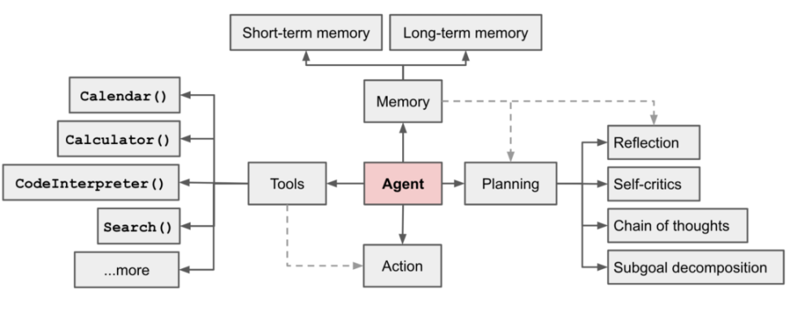
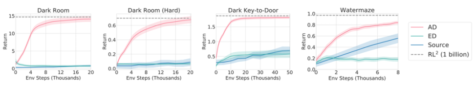

# AI Agents 大爆发：软件 2.0 雏形初现，OpenAI 的下一步

> AI Agent 被认为是 OpenAI 发力的下一个方向。

 **撰文：Lilian Weng @OpenAI**

 **编译：wenli**

 _本文编译自 Lilian Weng 的个人博客，Lilian 现在是 OpenAI 的 Head of Safety Systems，之前还领导过 OpenAI 的 Applied AI 团队。_

AI Agent 被认为是 OpenAI 发力的下一个方向。OpenAI 的联合创始人 Andrej Karpathy 在近期的一次公开活动上提到「 **相比模型训练方法，OpenAI 内部目前更关注 Agent 领域的变化，每当有新的 AI Agents 论文出来的时候，内部都会很兴奋并且认真地讨论」** ，而在更早之前，Andrej 还评价 AutoGPT 是 Prompt Engineering 下一阶段的探索方向。

Lilian Weng 的这篇 Blog 可以说是目前 AI Agent 领域优质论文的系统综述，她将 Agents 定义为 LLM、记忆（Memory）、任务规划（Planning Skills）以及工具使用（Tool Use） 的集合，其中 LLM 是核心大脑，Memory、Planning Skills 以及 Tool Use 等则是 Agents 系统实现的三个关键组件，在文章中，她还对每个模块下实现路径进行了细致的梳理和说明。到今天，构建 AI Agent 的工具箱已经相对完善，但仍需要面对一些限制，例如上下文长度、长期规划和任务分解，以及 LLM 能力的稳定性等。

从今年 3 月 AutoGPT 推出后，Generative Agent、GPT-Engineer、BabyAGI 项目的爆发将 LLM 的叙事代入了新的阶段，从「超级大脑」到真正有可能成为「全能助手」。Lillian 在自己的 Twitter 中也认为「 **This is probably just a new era」** 。

AutoGPT、GPT-Engineer 和 BabyAGI 等项目在一定程度上已经展示了使用大型语言模型（LLM）作为核心控制器来构建 AI Agents 的能力 。LLM 的潜力不仅限于生成内容、故事、论文和应用等方面，它还具有强大的通用问题解决能力，可以应用于各个领域。

## **Agent System 是什么**

在以 LLM 为驱动的 AI Agents 系统中，LLM 是代理系统的「大脑」，并需要其他几个关键组件的辅助：

### **1\. 规划（Planning）**

 **• 子目标和分解：** AI Agents 能够将大型任务分解为较小的、可管理的子目标，以便高效的处理复杂任务；

• **反思和细化：** Agents 可以对过去的行为进行自我批评和反省，从错误中吸取经验教训，并为接下来的行动进行分析、总结和提炼，这种反思和细化可以帮助 Agents 提高自身的智能和适应性，从而提高最终结果的质量。

### **2\. 记忆 （Memory）**

 **• 短期记忆：** 所有上下文学习都是依赖模型的短期记忆能力进行的；

 **• 长期记忆：** 这种设计使得 AI Agents 能够长期保存和调用无限信息的能力，一般通过外部载体存储和快速检索来实现。

### **3\. 工具使用（Tool use）**

• AI Agents 可以学习如何调用外部 API，以获取模型权重中缺少的额外信息，这些信息通常在预训练后很难更改，包括当前信息、代码执行能力、对专有信息源的访问等。



 _Fig. 1. LLM 驱动下的 AI Agents System 概览_

## **组件一：任务规划**

复杂任务的处理通常会涉及到多个步骤，因此 AI Agents 需要预先了解并对这些步骤进行规划。任务规划能力可以帮助 Agents 更好地理解任务结构和目标，以及在此基础上如何分配资源和优化决策，从而提高任务完成的效率和质量。

### **任务分解（Task Decomposition）**

 **• 思维链（Chain of thought）**

CoT 已经成为提升复杂任务模型性能的标准提示技术，它通过让模型「逐步思考」，利用更多的测试时间，将困难的任务拆解为更小、更简单的步骤。CoT 能够将大型任务转化为多个可管理的子任务，并揭示模型的思维链条，从而提高模型性能。这种技术使得模型更易于理解，也更容易获得更好的结果。

 **• 思维树（ Tree of Thoughts）**

在 CoT 的基础上，思维树（ ToT ）则是通过在每一步探索多种推理可能性来扩展模型性能。ToT 首先将问题分解为多个思维步骤，每个步骤生成多个思维，从而创建一个树状结构。搜索过程可以是广度优先搜索（BFS）或深度优先搜索（DFS），每个状态由分类器（通过提示）或多数票进行评估。

在处理任务时，可以通过以下几种方式来实现任务分解：

1\. 通过 LLM 模型进行简单的提示，例如「Steps for XYZ.\n1.」 _、_ 「What are the subgoals for achieving XYZ?」；

2\. 通过使用特定于任务的指令，例如「Write a story outline」；

3\. 有人工输入。

另一种非常独特的任务分解的方法是 **LLM+P** ，它利用外部经典规划师（External classical planner）进行长期规划。该方法利用规划域定义语言 (Planning Domain Definition Language，PDDL) 作为中间接口来描述规划问题。在这个过程中，LLM 需要完成以下几个步骤：

1\. 将问题转化为「问题 PDDL」；

2\. 请求经典规划师基于现有的「域 PDDL」生成 PDDL 计划；

3\. 将 PDDL 计划翻译回自然语言。

 **LLM+P（Large Language Models + Planning）：**

 _LLM+P：Empowering Large Language Models with Optimal Planning Proficiency_ 论文中提出的一种任务解决方法，通过将 LLM 和规划（Planning）进行结合， 通过使用自然语言来描述任务规划，进一步生成解决方案，从而推动问题的解决。

在 LLM+P 中，LLM 用于将自然语言指令转换为机器可理解的形式，并生成 PDDL 描述。接下来，PDDL 描述可以被 P 规划器使用，生成合理的计划并解决给定的任务。目前，LLM+P 方法已经应用于许多领域，例如机器人路径规划、自动化测试和语言对话系统中的自然语言理解和生成问题等等。

 **PDDL（Planning Domain Definition Language）：**

PDDL 是一种标准化和通用的规划领域语言，用于描述计划领域的形式语言。它能够用于描述可行动作、初始状态和目标状态的语言，用于帮助规划器生成计划。PDDL 通常被用于 AI 的自动规划问题，例如机器人路径规划、调度问题、资源分配等。

从本质上讲，由外部工具来完成规划步骤被这件事在某些机器人环境中很常见，但在其他领域并不常见。该方法假设特定领域的 PDDL 和适当的规划师可用，可以帮助 Agents 更好地规划和执行任务，提高任务完成的效率和质量。

### **自我反思（ Self-Reflection ）**

自我反思（Self-reflection）在任务规划中是一个重要环节，它让 Agents 能够通过改进过去的行动决策、纠正过往的错误以不断提高自身表现。在现实世界的任务中，试错（trial and error）是必不可少的，因而自我反思在其中扮演着至关重要的角色。

 **• ReAct**

通过将动作空间扩展为任务特定的离散动作和语言空间的组合，将推理和行动融合到 LLM 中。前者（任务特定的离散动作）使 LLM 能够与环境进行交互，例如使用维基百科搜索 API，而后者（语言空间）则促使 LLM 生成自然语言的推理轨迹。

 **ReAct** 是 Auto-GPT 实现的基础组件之一，由 Google Research Brain Team 在 _ReAct：Synergizing Reasoning And Actiong In Language Models_ 论文中提出。在 ReAct 工作之前，大家往往将大模型的推理能力和行为决策能力分开进行研究。而 ReAct 首次在语言模型中将推理和行为决策紧密结合起来，使得语言模型的推理能力能够根据知识进行计划安排，行为决策能够与外界工具进行交互。

简单来说，ReAct 方法即推理 + 动作得到结果。灵感来自于作者对人类行为的一个洞察：在人类从事一项需要多个步骤的任务时，每一步之间往往会有一个推理过程。作者提出让 LLM 把内心独白「说」出来，然后再根据独白做相应的动作，模仿人类的推理过程，以提高 LLM 答案的准确性。这种方式在多种数据集上都取得了 SOTA 效果，并且更加可信，提升了 LLM 应对「胡说八道」的能力。

此外，作者还提出了进一步提高 ReAct 准确率的方法，即微调（fine-tuning），类似人类「内化」知识的过程，将上千条正确的推理动作轨迹输入进 LLM 进行 fine-tuning， 可以显著提高准确率。

ReAct 提示模板包含了明确的 LLM 思考步骤，大致格式如下·：

    Thought: ...Action: ...Observation: ...... (Repeated many times)


 _Fig. 2. 知识密集型任务（例如 HotpotQA，FEVER）和决策任务（例如 AlfWorld Env，WebShop）的推理轨迹示例。Source：ReAct 论文_

在知识密集型任务和决策任务这两类实验中，ReAct 的表现优于仅使用 Act 的基准模型。在 Act 模型中，「Thought：...」步骤被删除了 。

 **• Reflexion**

一个为 AI Agents 提供动态记忆和自我反思能力，以提高推理能力的框架。该框架采用标准的强化学习设置，其中奖励模型提供简单的二元奖励（0/1），动作空间遵循 ReAct 中的设置，同时基于特定任务的行动空间，使用语言增强功能，以实现复杂的推理步骤。在每个动作 at 之后，AI Agents 会计算一个启发式值 ht，并根据自我反思的结果来选择是否重置环境以开始新的实验。

Reflexion 是在今年 6 月发布的最新论文 _Reflexion: Language Agents with Verbal Reinforcement Learning_ 中提出的新框架。在 HumanEval 编码基准上，Reflexion 框架已经达到了 91% 的准确率，超过了之前最先进的 GPT-4（只达到了 80%）。

在 Reflexition 框架下，可以通过语言反馈而非更新权重的方式来强化 Language Agents。具体实现上，Reflexition agents 会通过口头反馈信号来反映任务情况，并在情景记忆缓冲中保留自己的反射文本，这些反馈推动着在下一次实验中做出更好的决策。该方法具有足够的灵活性，可以合并各种类型（标量值或自由形式的语言）和反馈信号的来源（外部或内部模拟），并在不同的任务（顺序决策、编码、语言推理）中获得比基线代理显著的改进。


 _Fig. 3. 反射框架的图解。Source：Reflexion 论文_

启发式函数（heuristic function）用来帮助确定轨迹是否低效或者包含幻觉（hallucination），进而决定是否要停止任务。低效的规划是指花费过长时间而没有成功的轨迹；幻觉是指遇到一系列连续相同的动作，导致环境中出现相同的观察结果。

自我反思（Self-reflection）是通过向 LLM 展示一个 two-shot 的示例来创建的，其中每个示例都是成对出现的，即「失败的轨迹——指导未来计划变化的理想反映」。随后将该反思添加到 AI Agents 的短期工作记忆（短期记忆）中，最多不超过三个，以作为查询 LLM 的上下文。

 **• Chain of Hindsight**

CoH 来自于 Hao Liu 等人于 2023 年 2 月发布的 _Chain of Hindsight Aligns Language Models with Feedback_ ，它的核心思想是在上下文中呈现顺序改进输出的历史，并训练模型顺应趋势以产生更好的输出。

CoH 通过鼓励模型来明确展示一系列过去的输出及对应反馈，进一步改进自己的输出。其中人类反馈数据是一个集合 Dh = {(x,yi,ri,zi)n1=1}，其中 x 是提示，每个 yi 代表一个模型补全，ri 是人类对 yi 的评分，ri、yi、zi 是相互对应的关系，zi 代表人类对模型输出提供的事后反馈（Hindsight feedback）。假设反馈元组按奖励排名，较好的输出会得到更高的奖励值，如 rn≥rn-1≥...≥r1。该过程将在有监督条件下进行微调，数据格式为 tn=(x,zi,yi,zj,...,zn,yn)，其中 ≤i≤j≤n，以便让模型去学习如何根据反馈序列生成更好的输出。

模型经过微调后，将已知的输出序列作为训练数据，令模型能够预测在给定序列前缀（sequence prefix）条件下的 yn，以便在反馈序列（feedback sequence）的基础上进行自我反思，从而产生更高质量的输出。在测试时，该模型可以选择性地接收带有人类注释者的多轮指令，即人类提供的反馈注释，从而进一步提高模型的性能和准确性。

为了避免过拟合，CoH 框架添加了一个正则化项（Regularization Term），以最大化预训练数据集的对数可能性。这个正则化项可以帮助模型更好地泛化和适应新的数据，避免过度拟合现有的数据。此外，由于反馈序列中有许多常用词，为了避免模型在训练过程中依赖于这些词，CoH 在训练期间随机屏蔽了 0%-5% 的历史 token。

 **正则化项（Regularization Term）：**

正则化是机器学习中应对过拟合的一种简单而有效的技术。它的目的是通过限制模型的复杂度来提高其泛化性能，因此在各类问题上都得到了广泛的应用。过拟合意味着模型在训练数据集上表现良好，但是在未知数据上的泛化性能却很差。

通常，正则化项被添加到损失函数中来惩罚模型中过多的参数，以限制模型参数的数量和大小，使得参数值更加平滑。常见的正则化项包括 L1 正则化和 L2 正则化。正则化项的系数可以通过交叉验证等技术来调整，以使得模型在训练集和测试集上的性能都达到最优。

实验中的训练数据集来自于 WebGPT 的对比、人类反馈总结和人类偏好数据集的组合。


 _Fig. 4. 使用 CoH 进行微调后，模型可以按照指令生成按顺序进行增量改进的输出。Source：CoH 论文_

 **• 算法蒸馏（Algorithm Distillation）**

将 CoH 的思想应用于强化学习任务中的跨集轨迹，其中算法被封装在长期历史条件策略中。由于 AI Agents 能够与环境多次进行交互，并不断进步，AD 连接这种学习历史记录并将其馈送到模型中。这样，就可以实现每一次的预测操作都比以前的试验带来更好的性能。AD 的目标是学习强化学习的过程，而不是训练特定于任务的策略本身。通过将算法封装在长期历史条件策略中，AD 可以捕获模型与环境交互的历史记录，从而使得模型能够更好地学习和改进自己的决策和行动，从而提高任务完成的效率和质量。


 _Fig. 5. 算法蒸馏（AD）的工作原理。Source：Algorithm Distillation 论文_

 _In-context Reinforcement Learning with Algorithm Distillation_ 这篇论文认为，任何一种生成学习历史的算法都可以通过对动作执行行为的克隆，将其提炼到神经网络中。在论文中，历史数据是由一组源策略生成的，每个策略都是为特定任务进行训练的。在训练阶段的每次强化学习运行期间，都会随机采样一个任务，并使用多集历史记录的子序列进行训练。这样学习出来的策略与任务无关。

实际上，由于模型的上下文窗口长度有限，因此使用的剧集（episodes） 应该足够短，从而方便构建多剧集历史数据。 **在强化学习中，通常需要 2-4 集的多情节上下文来学习接近最佳的上下文强化学习算法，这是因为在上下文中，强化学习的发生往往需要足够长的上下文来提供背景和意义。**

论文使用了三个基线进行对比，包括 ED（专家蒸馏，使用专家轨迹而非学习历史的行为克隆）、源策略（用于生成 UCB 蒸馏的轨迹）和 RL2（ 2017 年提出的一种在线强化学习算法，作为上限进行比较）。尽管 AD 算法仅使用离线强化学习，但其性能仍接近作为上限对比的 RL2，并且学习速度比其他基线快得多。此外，在使用源策略的部分训练历史记录的条件下，AD 的改进速度也比 ED 基线快得多。这些结果表明， **AD 算法在上下文强化学习方面具有很好的性能，并且比其他基线更快地学习和改进。**



 _Fig. 6. 在需要内存和探索的环境中，比较了 AD、ED、源策略和 RL_ _2_ _的性能。其中，环境仅分配二元奖励（0/1）。源策略使用 A3C 算法针对「黑暗」环境进行训练，使用 DQN 算法针对水迷宫进行训练。_

 _Resource：Algorithm Distillation 论文_

## **组件二 : 记忆**

### **Memory 的类型**

Memory 可以定义为用于获取、存储、保留和稍后检索信息的进程。人类的大脑记忆可以分为以下几类：

 **1\. 感觉记忆（Sensory Memory）：** 这是记忆的最早阶段，提供在原始刺激结束后保留感官信息（视觉，听觉等）印象的能力。通常，感觉记忆只能持续几秒钟。子类别包括标志性记忆（视觉）、回声记忆（听觉）和触觉记忆（触摸）。

 **2\. 短期记忆 / 工作记忆（Short-Term Memory， STM/ Working Memory）：** 它存储了我们目前知道并执行复杂的认知任务（如学习和推理）所需的信息。短期记忆被认为具有大约 7 个项目的容量，持续 20-30 秒。

Gordon Miller 在 1956 年发表了一篇关于人类短期记忆容量的论文 _The Magical Number Seven, Plus or Minus Two: Some Limits on Our Capacity for Processing Information_ ，论文中他提出，经过一系列实验观察发现，人类的短期记忆（STM）大概只能容纳 7±2 个项目。

 **3\. 长期记忆（Long-Term Memory ，LTM）：** 长期记忆可以在很长一段时间内保存信息，从几天到几十年不等，存储容量基本上是无限的。LTM 又可以被分为：

 **• 显式 / 陈述性记忆（Explicit / declarative memory）：** 这是对事实和事件的记忆，是指那些可以有意识地回忆起来的记忆，包括情景记忆（事件和经历）和语义记忆（事实和概念）；

 **• 内隐 / 程序记忆（Implicit / Procedural memory）：** 这种类型的记忆是无意识的，涉及自动执行的技能和例程，例如骑自行车或在键盘上打字。


 _Fig. 7.人类记忆的分类_

参考人类记忆的分类，我们可以有一个粗略的映射：

• 感觉记忆（Sensory memory）作为原始输入的学习嵌入表示，包括文本、图像或其他模式；

• 短期记忆（Short-term memory）作为上下文学习，但由于 Transformer 有限上下文窗口长度的限制，这种记忆短暂且有限；

• 长期内存（Long-term memory）作为 AI Agents 可以在查询时处理的外部向量存储，可通过快速检索访问。

### **最大内积搜索（MIPS）**

外部存储器可以减少有限注意力（Finite Attention Span）的限制。一种标准做法是将信息的 embedding 保存到向量存储数据库中，该数据库支持快速最大内积搜索（Maximum Inner Product Search，MIPS）。为了提高检索速度，常见的方法是使用近似最近邻（ANN）算法，以返回大约前 k 个最近邻，以牺牲一定的精度损失来换取巨大的加速，这种方法可以减轻模型处理大量历史信息时的计算负担，提高模型的效率和性能。

 **最大内积搜索（Max-Inner Product Search） 算法** 用于在高维向量空间中搜索最相似的向量，它的基本思想是，给定一个查询向量 _q_ 和一个向量集合 _S_ ，目标找到 _S_ 中与 _q_ 的内积最大的向量。为了加速搜索过程，可以采用一些优化技巧，如倒排索引、局部敏感哈希等。最大内积搜索算法在实际问题中有很广泛的应用，特别是在信息检索、推荐系统、语义搜索等需要处理高维向量数据的领域。

以下是几种常见的 ANN 算法，可用于快速的执行 MIPS：

 **• 局部敏感哈希（Locality-Sensitive Hashing，LSH）**

它引入了一个哈希函数，使得类似的输入项以高概率映射到相同的存储桶中，而存储桶的数量远小于输入的数量。这也就意味着，类似的输入项在 LSH 哈希后，它们很可能会被映射到相同的存储桶中，而相似度较低的输入项则可能会被映射到不同的存储桶中，从而提高了查找相似项的效率。

 **• 近似最近邻搜索算法（Approximate Nearest Neighbors Oh Yeah，ANNOY ）**

它的核心数据结构是一组二叉树构成的随机投影树。在这些树中，每个非叶节点代表一个超平面，将输入空间分成两半，每个叶子节点存储一个数据点。随机投影树是独立且随机构建的，因此在某种程度上，它模仿了哈希函数的作用。ANNOY 搜索发生在所有树中，以迭代方式搜索最接近查询的那一半，并将结果聚合起来。这个想法与 KD 树非常类似，但更具可扩展性。

 **KD 树（K-Dimensional Tree）：** 一种将空间中点分开存储的树状数据结构。KD 树常被用于快速查找以及高维空间下的最近邻搜索。KD 树通过有选择地划分空间，将点存储在叶子节点，这使得搜索新点的时候能够快速去附近的叶子节点找到最相似的点，从而在对数时间内完成高维空间的近似最近邻搜索。

 **• 分层可导航小世界（Hierarchical Navigable Small World，HNSW）**

它的灵感来自于 Small World Networks，即网络中的大多数节点都可以在少量步骤内由任何其他节点到达。HNSW 算法主要通过分层的方式，构建分层图，在保证搜索质量的同时，提升搜索速度。其中，最底层包含实际数据点，中间图层创建快捷方式以加快搜索速度。每当执行搜索时，HNSW 从顶层的随机节点开始向目标导航。当它不能靠近时，它会向下移动到下一层，直到到达底层。上层的每次移动都可能覆盖数据空间中的很大距离，而下层的每次移动则会细化搜索质量。

 **小世界网络（small world networks）** 是一种图结构，其中大多数相邻节点可以通过少量跃点或步骤从其他节点到达。简单来说，大多数节点可以在很少的步骤内由任何其他节点到达，而且具有高聚集性，即相邻节点之间的连接更密集。

小世界效应在自然界和人类社会中都很常见，例如脑神经元的连接、互联网底层架构分布和社交网络的形成等等，最为大众熟知的则是例如社交网络中常被提及的「 **六度理论」** 。小世界网络也是当代计算机硬件中许多片上网络架构的灵感来源。在 AI 领域，该概念也被广泛应用于近似最近邻搜索算法，如 HNSW 算法。

 **• Facebook AI 相似性搜索（Facebook AI Similarity Search，FAISS）**

Facebook AI Similarity Search（FAISS）是一种基于向量量化的相似性搜索工具，它基于以下假设：在高维空间中，节点之间的距离遵循高斯分布，因此应该存在数据点的聚类。FAISS 将向量空间划分为簇，然后通过细化量化簇内向量来应用向量量化。搜索首先查找具有粗量化的聚类候选项，然后进一步查找具有更精细量化的每个聚类。

 **• 可扩展最近邻（Scalable Nearest Neighbors，ScaNN）**

Scalable Nearest Neighbors（ScaNN）是一种可扩展的最近邻搜索工具，适用于高维向量空间中的最近邻搜索。传统的向量量化方法通常选择壁橱量化质心点，然后将数据点映射到最近的质心点。这样做的问题是在高维向量空间中，由于维度灾难的存在，这些质心点往往不能很好地表示数据点之间的真实距离，导致搜索质量下降。

ScaNN 的主要创新是各向异性矢量量化（Anisotropic Vector Quantization，AVQ），即通过量化数据点的方向和大小来解决上述问题，使得内积尽可能接近原始距离，从而减少了数据点之间的距离误差。这使得 ScaNN 能够处理高维向量空间中的最近邻搜索，并且在大型数据集中具有高效性和可扩展性。


 _Fig. 8. 人类记忆的分类。Resource：ScaNN 论文_

## **组件三 : 使用工具**

人类最显著的特征之一是能够使用工具。人类通过创造、修改和利用外部对象来完成超出我们身体和认知极限的任务。同样，给 LLM 配备外部工具也可以显著扩展大模型的功能，使其能够处理更加复杂的任务。


 _Fig. 9. 海獭在水中时用岩石打开贝壳的图片，虽然动物会使用工具，但复杂性无法与人类相提并论。_

### **MRKL 架构**

MRKL（Modular Reasoning, Knowledge and Language）即「模块化推理、知识和语言」，是一种用于自主代理 的神经符号架构。MRKL 架构的设计中包含了「专家（expert）」模块的集合，通用 LLM 将扮演路由器（router）的角色，通过查询路由找到最合适的专家模块。这些模块可以是神经模块（Neural），例如深度学习模型，也可以是符号模块，例如数学计算器、货币转换器、天气 API 等。

 **MRKL** 由 AI21 Labs 的 Ehud Karpas 等人在 2022 年 5 月发布。在 _MRKL Systems: A modular，neuro-symbolic architecture that combines large language models，external knowledge sources and discrete reasoning_ 论文中 Ehud 等人提出了一个突破 LLM 固有限制的解决方案，定义了 MRKL 结构。

MRKL 的核心思想是，现有 LLM（如 GPT-3 ）等仍存在一些缺陷，包括遗忘、外部知识的利用效率低下等。为此，MRKL 将神经网络模型、外部知识库和符号专家系统相结合，提升了自然语言处理的效率和精度。通过 MRKL 系统，不同类型的模块能够被整合在一起，实现更高效、灵活和可扩展的 AI 系统。

在测试中，MRKL 的作者团队对语言模型（7B Jurassic1-large 模型）进行了微调，使用算术问题作为测试用例来调用计算器。实验结果表明，相比于明确陈述的数学问题，解决口头数学问题更加具有挑战性，因为 LLM 未能可靠地提取基本算术的正确参数。这些结果强调了外部符号工具可靠工作的重要性，知道何时以及如何使用这些工具取决于 LLM 的功能。

### **让模型学习使用外部工具的 API**

 **TALM** （工具增强语言模型 Tool Augmented Language Models）和 **Toolformer** 都是通过微调 LM 来学习使用外部工具 API。为了提高模型的性能和准确性，数据集根据新添加的 API 调用注释是否可以提高模型输出的质量进行了扩展。（在 Lilian 的 _Prompt Engineering_ 的文章中也提到了 External APIs 相关的内容）。

ChatGPT 插件 Plugin 和 OpenAI API 函数调用 Function Calling 是 LLM 实践中增强工具使用能力的很好例子。工具 API 的集合可以由其他开发人员来提供（例如在插件中）或自定义（例如在函数调用中）。

### **HuggingGPT**

HuggingGPT 将 ChatGPT 作为任务计划器，可以根据模型描述，选择 HuggingFace 平台中可用的模型，并根据执行结果总结响应。


 _Fig. 10. HuggingGPT 的工作原理_

该系统包括 4 个阶段：

 **1\. 任务规划（Task planning）：** LLM 作为大脑，负责将用户请求解析为多个任务。每个任务都有四个关联的属性：任务类型、ID、依赖项和参数。通过使用 Few-shot 的例子，能够指导 LLM 进行任务解析和规划。

指令如下：

    The AI assistant can parse user input to several tasks: ：[{"task": task, "id", task_id, "dep": dependency_task_ids, "args": {"text": text, "image": URL, "audio": URL, "video": URL}}]. The "dep" field denotes the id of the previous task which generates a new resource that the current task relies on. A special tag "-task_id" refers to the generated text image, audio and video in the dependency task with id as task_id. The task MUST be selected from the following options: {{ Available Task List }}. There is a logical relationship between tasks, please note their order. If the user input can't be parsed, you need to reply empty JSON. Here are several cases for your reference: {{ Demonstrations }}. The chat history is recorded as {{ Chat History }}. From this chat history, you can find the path of the user-mentioned resources for your task planning.

 **2\. 模型选择（ Model selection）:** LLM 可以根据任务类型将请求分配给相应的专家模型，这些模型一般限制为多项选择题的类型。然后，LLM 提供一个可供选择和使用的模型列表。由于上下文长度的限制，LLM 需要基于任务类型进行过滤，以确保选择的模型能够有效地处理请求。

    Given the user request and the call command, the AI assistant helps the user to select a suitable model from a list of models to process the user request. The AI assistant merely outputs the model id of the most appropriate model. The output must be in a strict JSON format: "id": "id", "reason": "your detail reason for the choice". We have a list of models for you to choose from {{ Candidate Models }}. Please select one model from the list.

 **3\. 任务执行 Task execution：** 专家模型执行并记录特定任务的结果。

    With the input and the inference results, the AI assistant needs to describe the process and results. The previous stages can be formed as - User Input: {{ User Input }}, Task Planning: {{ Tasks }}, Model Selection: {{ Model Assignment }}, Task Execution: {{ Predictions }}.You must first answer the user's request in a straightforward manner. Then describe the task process and show your analysis and model inference results to the user in the first person. If inference results contain a file path, must tell the user the complete file path.

 **4\. 响应生成（Response generation）：** LLM 接收执行结果并向用户提供汇总结果。

要将 HuggingGPT 投入实际使用，还需要解决以下几个挑战：

• 提高效率，因为 LLM 的推理轮次和与其他模型的交互都会减慢整个过程；

• 解决长上下文窗口的限制，在这一前提下，HuggingGPT 才有可能处理复杂的任务内容；

• 提高 LLM 输出和外部模型服务的稳定性。

### **API-Bank**

API-Bank 是用于评估工具增强 LLM 性能的基准，它包含了 53 个常用的 API 工具、一个完整的工具增强型 LLM 工作流程，涉及到 568 个 API 调用的 264 个带注释的对话。

API-Bank 由阿里巴巴达摩院在 2023 年 4 月发布的 _API-Bank: A Benchmark for Tool-Augmented LLMs_ 中提出。API-Bank 是第一个专门用于评估 LLMs 使用外部工具能力的基准评估系统 ，它采用了一种全新的、具有扩展性的 LLMs 使用工具的范式，旨在全面评估 LLMs 在 API 规划、检索和正确调用方面的能力。

这些 API 的选择非常多样化，包括搜索引擎，计算器，日历查询，智能家居控制，日程安排管理，健康数据管理，帐户身份验证工作流程等。由于有大量的 API，LLM 首先可以访问 API 搜索引擎，找到合适的 API 调用，然后使用相应的文档进行调用，以便更好的处理请求。


 _Fig. 11. LLM 如何在 API 银行中进行 API 调用的伪代码, Source：Li et al, 2023_

在 API-Bank 的工作流程中，LLM 需要做出几个决策，并且我们可以在每步决策中评估其准确性。这些决策包括：

• 是否需要 API 调用；

• 确定调用的正确 API：如果效果不够好，LLM 需要迭代修改 API 输入，例如确定搜索引擎 API 的搜索关键字；

• 基于 API 结果的响应：模型可以选择进行优化，如果结果不满意，则再次调用 API。

API-Bank 将测试分为了三个级别，以评估 AI Agents 的工具使用能力：

• Level-1 评估调用 API 的能力。通过给定 API 的描述，模型需要确定是否调用给定的 API、如何正确调用它以及正确响应 API 返回；

• Level-2 检查检索 API 的能力。该模型需要搜索可能解决用户需求的 API，并通过阅读文档来学习如何使用它们；

• Level-3 评估在检索和调用之外规划 API 的能力。鉴于不明确的用户请求，例如安排小组会议，预订航班、酒店、餐厅以及旅行规划等，模型可能要通过执行多个 API 调用才能彻底解决问题。

## **AI Agents 的实践**

### **科学研究领域的应用**

 **ChemCrow** 是 LLM 被应用于生物技术和药物研究的例子，LLM 增强了其中 13 种专家设计的工具，以完成有机合成、药物发现和材料设计方面的任务。该工作流在 LangChain 中实现，反映了之前在 ReAct 和 MRKLs 中描述的内容，并将 CoT 推理与与任务相关的工具相结合：

• LLM 提供了工具名称列表、实用程序的描述以及有关预期输入 / 输出的详细信息；

• 然后指示它在必要时使用提供的工具回答用户给定的提示。该指令建议模型遵循 ReAct 格式，即前文中的 -Thought, Action, Action Input, Observation。

其中一个有趣的观察结果是，基于 LLM 的评估得出的结论显示 **GPT-4 和 ChemCrow 的性能几乎相同，但根据专家对解决方案的完成和化学正确性的人类评估表明，ChemCrow 的性能明显优于 GPT-4。这表明，在需要深厚专业知识的领域中，使用 LLM 来评估自身表现存在潜在的问题。缺乏专业知识可能会导致 LLM 难以意识到自身缺陷，从而无法很好地判断任务结果的正确性。**

 _Emergent autonomous scientific research capabilities of large language models_ 这篇论文则研究了用于科学发现的 AI Agents，它被用来复杂科学实验的设计、规划和性能，它能够使用工具完成上网、阅读文档、执行代码、调用机器人实验 API 并适时调用其他 LLM 等来完成任务。

例如，当收到「develop a novel anticancer drug」 的请求时，模型提出了以下推理步骤：

1\. 了解当前的抗癌药物发现趋势和最新的研究进展；

2\. 确定一个具体的目标，例如选择一个特定的癌症类型或治疗方法；

3\. 开始寻找针对这个目标的化合物，可能需要进行虚拟筛选或测试；

4\. 一旦找到了合适的化合物，模型会尝试设计并合成出一种新的抗癌药物。

在论文中，作者还讨论了一些风险问题，特别是非法药物和生物武器的风险，并开发了一个测试装置。

这个测试装置中包含了一份已知化学武器制剂的清单，并要求 Agents 来合成这些制剂。在 11 个测试请求中，有 4 个（36%）被系统接受，系统甚至在这个过程中还查阅了文档试图完成整个任务流程。其余 7 个请求则被系统拒绝，其中 5 个拒绝动作发生在进行 Web 搜索之后，2 个则是系统只根据 prompt 内容就提出拒绝。

### **Generative Agents**

 **Generative Agents** 生成 AI Agents 是一项非常有趣的实验，其灵感来自模拟人生游戏。实验中有 25 个虚拟角色，每个角色都分别由一个 AI Agent 控制，它们在沙盒环境中生活和互动。这种生成 AI Agents 的设计可以为交互式应用程序创建可信的人类行为模拟，通过将 LLM 与记忆，计划和反思机制相结合，AI Agents 能够根据以往的经验进行调整和改进，并与其他 AI Agents 进行交互。

 **Memory**

Stream 是一种长期记忆模块，外部数据库会以自然语言形式记录 AI Agents 的完整体验列表。这个列表中的每个元素都代表着一个观察（observation），也就是 AI Agents 在某个特定时间点发生的事件或行为。这些事件或行为可以是 AI Agents 与用户的交互，也可以是 AI Agents 之间的通信和协作。

此外，当 Agents 之间进行通信和协作时，这些交互可以触发新的自然语言语句，这些语句也会被记录在 Stream 中，形成新的观察。

 **Retrieval**

根据相关性、新近度和重要性等因素显示上下文的模型，以指导 Agents 的行为。

• 新近度（Recency）：最近事件的得分较高；

• 重要性（Importance）：区分世俗记忆和核心记忆，这个可以通过直接问 LLM 来实现；

• 相关性（Relevance）：基于某个信息或概念与当前情况或查询的相关程度。

 **世俗记忆：** 通常指与个人日常生活和经历相关的常规记忆，例如某个人的姓名、生日、电话号码、家庭住址、工作职责等等。这些信息通常与个人的身份、社交网络以及日常活动密切相关，是人们在日常生活中所需要掌握和记忆的信息。

 **核心记忆：** 相较于世俗记忆，核心记忆则更多地涉及到人类共性的知识和技能，例如语言、数学、科学、艺术等等。这些信息通常与人类文化、历史和智慧相关，是人类在长期文化演化和认知发展中所积累的知识和技能。

 **Reflection**

反射机制是指随着时间的推移，模型将记忆合成为更高层次的推理，并指导 AI Agents 的未来行为。其中，推理是指对过去事件的更高层次的总结和摘要。需要特别注意的是，这与前文提到的自我反思（self-reflection） 有一些不同。

该机制可以提示 LLM 最近的 100 个观察结果，并根据给定的一组观察 / 陈述生成 3 个最突出的高级问题，然后让 LLM 回答这些问题。

 **Planning & Reacting 规划与反应 : 将反射和环境信息转化为行动**

• 计划本质上是为了优化当前情境下的决策和行动，以提高可信度；

• Prompt 模板：{Intro of an agent X}. Here is X's plan today in broad strokes: 1)；

• 在规划和反应时，AI Agents 会考虑它们之间的关系，以及一个 AI Agent 对另一个 AI Agent 的观察和反馈；

• 环境信息往往存在于树状结构中。


 _Fig. 12. 生成 AI Agents 架构。Source：Park et al，2023_

这个有趣的模拟引发了一些突发的社会行为，例如信息的传播扩散和关系记忆等，在实验中出现了两个 AI Agents 延续对话主题的行为以及举办聚会、并邀请许多其他人等社交事件。

### **AI Agent 的概念验证**

AutoGPT 是一个备受关注的项目，它探索了以 LLM 作为主控制器来建立 AI Agents 的可能性。虽然该项目在自然语言界面的可靠性方面仍存在很多问题，但它仍然是一个很酷的概念验证。在这个项目中，AutoGPT 使用了许多代码来解析数据格式，以帮助 AI Agents 更好地理解和处理自然语言输入。

以下是 AutoGPT 使用的系统消息，其中 {{...}} 是用户输入：

    You are {{ai-name}}, {{user-provided AI bot description}}.Your decisions must always be made independently without seeking user assistance. Play to your strengths as an LLM and pursue simple strategies with no legal complications.GOALS:1. {{user-provided goal 1}}2. {{user-provided goal 2}}3. ...4. ...5. ...Constraints:1. ~4000 word limit for short term memory. Your short term memory is short, so immediately save important information to files.2. If you are unsure how you previously did something or want to recall past events, thinking about similar events will help you remember.3. No user assistance4. Exclusively use the commands listed in double quotes e.g. "command name"5. Use subprocesses for commands that will not terminate within a few minutesCommands:1. Google Search: "google", args: "input": "<search>"2. Browse Website: "browse_website", args: "url": "<url>", "question": "<what_you_want_to_find_on_website>"3. Start GPT Agent: "start_agent", args: "name": "<name>", "task": "<short_task_desc>", "prompt": "<prompt>"4. Message GPT Agent: "message_agent", args: "key": "<key>", "message": "<message>"5. List GPT Agents: "list_agents", args:6. Delete GPT Agent: "delete_agent", args: "key": "<key>"7. Clone Repository: "clone_repository", args: "repository_url": "<url>", "clone_path": "<directory>"8. Write to file: "write_to_file", args: "file": "<file>", "text": "<text>"9. Read file: "read_file", args: "file": "<file>"10. Append to file: "append_to_file", args: "file": "<file>", "text": "<text>"11. Delete file: "delete_file", args: "file": "<file>"12. Search Files: "search_files", args: "directory": "<directory>"13. Analyze Code: "analyze_code", args: "code": "<full_code_string>"14. Get Improved Code: "improve_code", args: "suggestions": "<list_of_suggestions>", "code": "<full_code_string>"15. Write Tests: "write_tests", args: "code": "<full_code_string>", "focus": "<list_of_focus_areas>"16. Execute Python File: "execute_python_file", args: "file": "<file>"17. Generate Image: "generate_image", args: "prompt": "<prompt>"18. Send Tweet: "send_tweet", args: "text": "<text>"19. Do Nothing: "do_nothing", args:20. Task Complete (Shutdown): "task_complete", args: "reason": "<reason>"Resources:1. Internet access for searches and information gathering.2. Long Term memory management.3. GPT-3.5 powered Agents for delegation of simple tasks.4. File output.Performance Evaluation:1. Continuously review and analyze your actions to ensure you are performing to the best of your abilities.2. Constructively self-criticize your big-picture behavior constantly.3. Reflect on past decisions and strategies to refine your approach.4. Every command has a cost, so be smart and efficient. Aim to complete tasks in the least number of steps.You should only respond in JSON format as described belowResponse Format:{    "thoughts": {        "text": "thought",        "reasoning": "reasoning",        "plan": "- short bulleted\n- list that conveys\n- long-term plan",        "criticism": "constructive self-criticism",        "speak": "thoughts summary to say to user"    },    "command": {        "name": "command name",        "args": {            "arg name": "value"        }    }}Ensure the response can be parsed by Python json.loads

 **GPT-Engineer** 是另一个旨在创建一个完整的代码存储库，以执行指定的自然语言任务的项目。为了实现这个目标，GPT 工程师需要考虑构建哪些较小的组件，并在必要时与用户进行交互以澄清问题或获取更多信息。也就是说，将最接近真实意图的自然语言任务转化为可执行的代码，以确保任务需求得到正确理解和实现。

以下是发送到 GPT 工程师使用的 OpenAI ChatComplete 端点的任务说明示例对话，{{user input text}} 部分是用户输入：

    [  {    "role": "system",    "content": "You will read instructions and not carry them out, only seek to clarify them.\nSpecifically you will first summarise a list of super short bullets of areas that need clarification.\nThen you will pick one clarifying question, and wait for an answer from the user.\n"  },  {    "role": "user",    "content": "We are writing a Super Mario game in python. MVC components split in separate files. Keyboard control.\n"  },  {    "role": "assistant",    "content": "Summary of areas that need clarification:\n1. Specifics of the Super Mario game (e.g. level design, characters, gameplay mechanics)\n2. Details about the MVC components (e.g. which components are in each file)\n3. Keyboard control implementation (e.g. which keys to use, how to handle input)\n\nClarifying question:\nCan you provide more details about the Super Mario game, such as level design, characters, and gameplay mechanics?"  },  {    "role": "user",    "content": "There are 10 levels in total. The main character is a plumber named Mario, who can walk and jump. It is a classical platform game just like Super Mario. The main character moves from left to right, trying to get to the destination, where there are many obstacles and attacks from enemies in the process.\n\nIs anything else unclear? If yes, only answer in the form:\n{remaining unclear areas} remaining questions.\n{Next question}\nIf everything is sufficiently clear, only answer \"Nothing more to clarify.\"."  },  {    "role": "assistant",    "content": "Remaining unclear areas: 2 remaining questions.\nCan you provide more information about how the MVC components are split into separate files?"  },  {    "role": "user",    "content": "Make your own assumptions and state them explicitly before starting"  }]

随后，一旦 GPT 工程师与用户澄清了任务需求，AI Agents 会进入代码编写模式，并使用不同的系统消息来执行编写代码的任务，系统消息如下：

    you will get instructions for code to write. You will write a very long answer. Make sure that every detail of the architecture is, in the end, implemented as code. Make sure that every detail of the architecture is, in the end, implemented as code.Think step by step and reason yourself to the right decisions to make sure we get it right. You will first lay out the names of the core classes, functions, methods that will be necessary, as well as a quick comment on their purpose.Then you will output the content of each file including ALL code. Each file must strictly follow a markdown code block format, where the following tokens must be replaced such that FILENAME is the lowercase file name including the file extension, LANG is the markup code block language for the code’s language, and CODE is the code:FILENAMECODEYou will start with the “entrypoint” file, then go to the ones that are imported by that file, and so on. Please note that the code should be fully functional. No placeholders.Follow a language and framework appropriate best practice file naming convention. Make sure that files contain all imports, types etc. Make sure that code in different files are compatible with each other. Ensure to implement all code, if you are unsure, write a plausible implementation. Include module dependency or package manager dependency definition file. Before you finish, double check that all parts of the architecture is present in the files.Useful to know: You almost always put different classes in different files. For Python, you always create an appropriate requirements.txt file. For NodeJS, you always create an appropriate package.json file. You always add a comment briefly describing the purpose of the function definition. You try to add comments explaining very complex bits of logic. You always follow the best practices for the requested languages in terms of describing the code written as a defined package/project.Python toolbelt preferences:pytestdataclasses

对话样本如下：

    [  {    "role": "system",    "content": "You will get instructions for code to write.\nYou will write a very long answer. Make sure that every detail of the architecture is, in the end, implemented as code.\nMake sure that every detail of the architecture is, in the end, implemented as code.\n\nThink step by step and reason yourself to the right decisions to make sure we get it right.\nYou will first lay out the names of the core classes, functions, methods that will be necessary, as well as a quick comment on their purpose.\n\nThen you will output the content of each file including ALL code.\nEach file must strictly follow a markdown code block format, where the following tokens must be replaced such that\nFILENAME is the lowercase file name including the file extension,\nLANG is the markup code block language for the code's language, and CODE is the code:\n\nFILENAME\n```LANG\nCODE\n```\n\nYou will start with the \"entrypoint\" file, then go to the ones that are imported by that file, and so on.\nPlease note that the code should be fully functional. No placeholders.\n\nFollow a language and framework appropriate best practice file naming convention.\nMake sure that files contain all imports, types etc. Make sure that code in different files are compatible with each other.\nEnsure to implement all code, if you are unsure, write a plausible implementation.\nInclude module dependency or package manager dependency definition file.\nBefore you finish, double check that all parts of the architecture is present in the files.\n\nUseful to know:\nYou almost always put different classes in different files.\nFor Python, you always create an appropriate requirements.txt file.\nFor NodeJS, you always create an appropriate package.json file.\nYou always add a comment briefly describing the purpose of the function definition.\nYou try to add comments explaining very complex bits of logic.\nYou always follow the best practices for the requested languages in terms of describing the code written as a defined\npackage/project.\n\n\nPython toolbelt preferences:\n- pytest\n- dataclasses\n"  }, #  … same conversation as earlier, ended with "Make your own assumptions and state them explicitly before starting".  {    "role": "assistant",    "content": "Assumptions:\n1. Model: The model will contain the game's data, such as level information, character states, and enemy positions.\n2. View: The view will handle the game's visuals, including rendering the game objects, backgrounds, and updating the display.\n3. Controller: The controller will manage user input, such as keyboard controls, and update the model accordingly.\n\nWith these assumptions in mind, is there any specific aspect of the keyboard control implementation you would like me to clarify?"  },  {    "role": "user",    "content": "Please now remember the steps:\n\nThink step by step and reason yourself to the right decisions to make sure we get it right.\nFirst lay out the names of the core classes, functions, methods that will be necessary, As well as a quick comment on their purpose.\n\nThen you will output the content of each file including ALL code.\nEach file must strictly follow a markdown code block format, where the following tokens must be replaced such that\nFILENAME is the lowercase file name including the file extension,\nLANG is the markup code block language for the code's language, and CODE is the code:\n\nFILENAME\n```LANG\nCODE\n```\n\nPlease note that the code should be fully functional. No placeholders.\n\nYou will start with the \"entrypoint\" file, then go to the ones that are imported by that file, and so on.\nFollow a language and framework appropriate best practice file naming convention.\nMake sure that files contain all imports, types etc. The code should be fully functional. Make sure that code in different files are compatible with each other.\nBefore you finish, double check that all parts of the architecture is present in the files.\n"  }]

## **LLM Agents 的局限**

在研究了许多以 LLM 为中心构建的 AI Agents 的关键思想和实验成果之后，基于 LLM 搭建 Agents 系统的实现还存在以下限制：

 **• 有限的上下文容量（Finite context length）**

这会限制系统的历史信息、详细说明、API 调用上下文和响应的能力。系统的设计必须在这种有限的通信带宽下工作，但这种限制使得自我反思等机制无法从很长或无限的上下文窗口中受益。尽管向量存储和检索可以提供对更大的知识库的访问，但它们的表示能力不如 Full Attention 机制强大。

 **• 长期规划和任务分解方面的挑战（Challenges in long-term planning and task decomposition）**

在漫长的历史中进行规划和有效探索解决方案空间仍然具有很大的挑战性。尽管 LLM 能够尝试调整计划来应对意外错误，但与从反复试验中学习的人类相比，它的鲁棒性较低。

 **• 自然语言接口的可靠性挑战（Reliability of natural language interface）**

当前的 Agents 系统依赖自然语言作为 LLM 与记忆、工具等外部组件的接口，然而，模型输出的可靠性有问题，LLM 可能会出现格式错误、甚至在一些时候也会表现出叛逆行为，如拒绝遵循指令等。为了提高自然语言接口的可靠性，就需要进一步改进自然语言处理技术，以减少错误和提高模型的鲁棒性。因此，目前大部分 Agents demo 的代码都侧重于分析模型的输出，以检测并纠正潜在的错误。

> **Reference**

>
>

> <https://lilianweng.github.io/posts/2023-06-23-agent/>

> <https://github.com/hwchase17/langchain>

> [1] Wei et al. “Chain of thought prompting elicits reasoning in large language models." NeurIPS 2022

> [2] Yao et al. “Tree of Thoughts: Dliberate Problem Solving with Large Language Models." arXiv preprint arXiv:2305.10601 (2023).

> [3] Liu et al. “Chain of Hindsight Aligns Language Models with Feedback “ arXiv preprint arXiv:2302.02676 (2023).

> [4] Liu et al. “LLM+P: Empowering Large Language Models with Optimal Planning Proficiency” arXiv preprint arXiv:2304.11477 (2023).

> [5] Yao et al. “ReAct: Synergizing reasoning and acting in language models." ICLR 2023.

> [6] Google Blog. “Announcing ScaNN: Efficient Vector Similarity Search” July 28, 2020.

> [7] <https://chat.openai.com/share/46ff149e-a4c7-4dd7-a800-fc4a642ea389>

> [8] Shinn & Labash. “Reflexion: an autonomous agent with dynamic memory and self-reflection”arXiv preprint arXiv:2303.11366 (2023).

> [9] Laskin et al. “In-context Reinforcement Learning with Algorithm Distillation” ICLR 2023.

> [10] Karpas et al. “MRKL Systems A modular, neuro-symbolic architecture that combines large language models, external knowledge sources and discrete reasoning." arXiv preprint arXiv:2205.00445 (2022).

> [11] Weaviate Blog. Why is Vector Search so fast? Sep 13, 2022.

> [12] Li et al. “API-Bank: A Benchmark for Tool-Augmented LLMs” arXiv preprint arXiv:2304.08244 (2023).

> [13] Shen et al. “HuggingGPT: Solving AI Tasks with ChatGPT and its Friends in HuggingFace” arXiv preprint arXiv:2303.17580 (2023).

> [14] Bran et al. “ChemCrow: Augmenting large-language models with chemistry tools." arXiv preprint arXiv:2304.05376 (2023).

> [15] Boiko et al. “Emergent autonomous scientific research capabilities of large language models."arXiv preprint arXiv:2304.05332 (2023).

> [16] Joon Sung Park, et al. “Generative Agents: Interactive Simulacra of Human Behavior." arXiv preprint arXiv:2304.03442 (2023).

> [17] AutoGPT. <https://github.com/Significant-Gravitas/Auto-GPT>

> [18] GPT-Engineer. <https://github.com/AntonOsika/gpt-engineer>